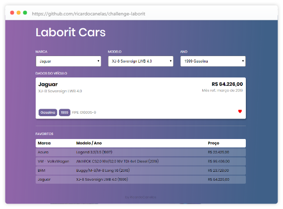

# ⚓ Challenge / Laborit

Challenge by: [https://gitlab.com/snippets/1837383](https://gitlab.com/snippets/1837383)

This project was bootstrapped with [Create React App](https://github.com/facebook/create-react-app).

👁 Live: [https://ricardocanelas.github.io/challenge-laborit](https://ricardocanelas.github.io/challenge-laborit)

## Getting Started

### 👉🏻 Prerequisites

* [Git]
* [NPM] or [Yarn]

### 👉🏻 Installing

1. Clone this repository using `git clone`
2. Onto the this project, install the dependecies using `npm install` or `yarn install`

The website will be available at http://localhost:3000

## License

This project is licensed under the MIT License - see the [LICENSE](LICENSE) file for details.

[storybook]: https://github.com/storybooks/storybook
[jest]: https://jest-everywhere.now.sh
[git]: https://git-scm.com
[npm]: https://www.npmjs.com/get-npm
[yarn]: https://yarnpkg.com
